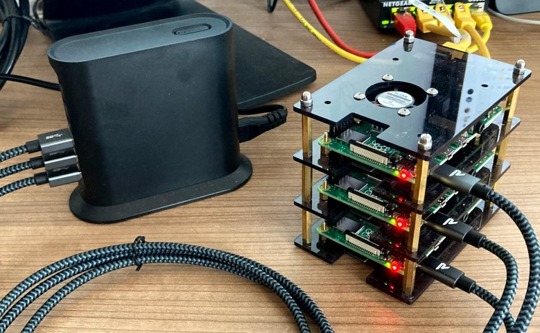
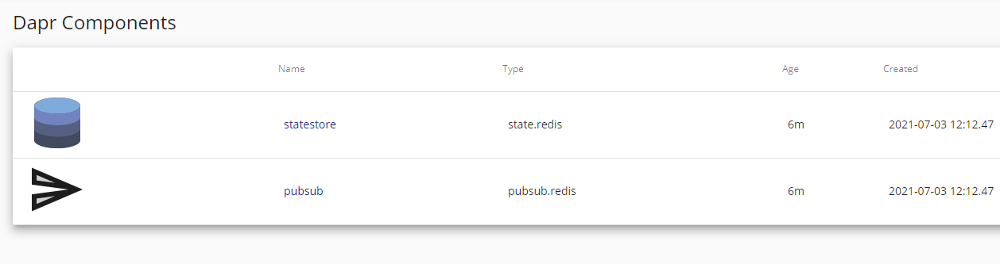

# 1. Kubernetes on Raspeberry PI
This documentation is used to create a raspberry PI kubernetes cluster. This is not a full documentation, just some reminders/notes for myself.

The result of the setup looks like this:



## 1.1 OS Install
The images are Ubuntu 21.04 arm64 which works with Raspberry 4. Follow the instructions providied by Ubunut: https://ubuntu.com/tutorials/how-to-install-ubuntu-on-your-raspberry-pi

## 1.2 Network configuration
To apply a static IP edit ```/etc/netplan/*```

```yaml
network:
    ethernets:
        eth0:
            dhcp4: false
            optional: false
            addresses: [192.168.1.111/24]
            gateway4: 192.168.1.1
            nameservers:
              addresses: [192.168.1.1, 9.9.9.9]
    version: 2
```

Provide a hostname for the new system:

```
sudo hostnamectl set-hostname <hostname>
```

## 1.3 Kubernetes Install
Follow the instructions provided by ubuntu: https://ubuntu.com/tutorials/how-to-kubernetes-cluster-on-raspberry-pi

### 1.3.1 MetalLB
https://microk8s.io/docs/addon-metallb

```
microk8s enable metallb:192.168.1.120-192.168.1.140
```

The subnet range of 192.168.1.120 to 192.168.1.140 is used, which does not conflict with any DHCP reservations used on the same subnet.


### 1.3.2 Storage - PersistenVolumeClaim - pvc
"If you're using Microk8s, you have to enable storage before you can start a PersistentVolumeClaim successfully." (https://stackoverflow.com/questions/44891319/kubernetes-persistent-volume-claim-indefinitely-in-pending-state)

```
microk8s enable storage
```

Remove the old existing storage
```
kubectl delete pvc name1 name2 etc...
```

### 1.3.3 Redis on arm64
Unfortunately the helm-way of installing redis is not possible, therefor a more manual way needs to be done (https://rpi4cluster.com/k3s/k3s-redis/)

## 1.4 Dapr
Follow the instructions provided by dapr how to install dapr on kubernetes (https://github.com/dapr/quickstarts/tree/master/hello-kubernetes)

Install the dapr-cli (https://docs.dapr.io/getting-started/install-dapr-cli/) or go with something like scoop (https://scoop.sh/)

### 1.4.1 Redis State-Store
Setup the state-store and a pubsub component (https://docs.dapr.io/getting-started/configure-state-pubsub/). The components can be verified by having a look at the dashboard:

```
dapr dashboard -k
```



